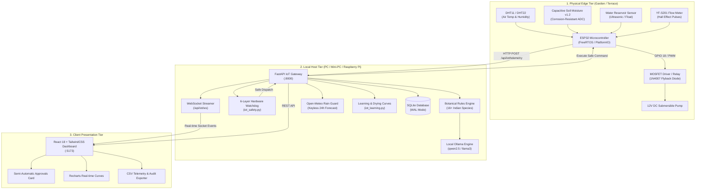

# JalRakshak Garden AI — Comprehensive Engineering & System Report

**Theme:** Touch Grass · Water Less, Live More  
**Target Environment:** Arid & Semi-Arid Climates (e.g., Gujarat, Western India)  
**System Class:** Edge-to-Local IoT Smart Garden with Local Open-Weight AI  
**Repository:** `gunmasterg9/JalRakshak-Garden-AI`  
**Date:** October 2026  

---

## 1. Executive Summary

**JalRakshak Garden AI** is an open-source, privacy-preserving, local-first IoT smart gardening system. It eliminates arbitrary cloud dependencies and brittle subscription APIs by pairing inexpensive edge hardware (ESP32 / Arduino) with a local FastAPI backend, SQLite database, and local open-weight AI models (Ollama: Qwen2.5, Llama 3, Gemma).

### Core Problem Solved
Urban gardeners and smallholder terrace farmers in hot, arid regions face severe challenges:
1. **Midday Evaporation & Over-Watering:** Pouring water on rigid clock schedules leads to root rot and up to 40% evaporative waste.
2. **Hardware Dry-Run Burn-In:** Small DC submersible pumps frequently burn out if activated when the water reservoir is empty.
3. **Cloud Fragility & Privacy Risks:** Many consumer smart watering hubs fail when internet access drops and harvest personal environmental telemetry.
4. **"Screen Traps":** Traditional IoT apps keep users glued to dashboards instead of enjoying their gardens.

### The "Touch Grass" Paradigm
JalRakshak flips the usual smart-home experience:
- Telemetry runs in the background.
- Decisions are explained transparently in plain Gujarati, Hindi, or English.
- The system issues daily physical micro-missions (e.g., soil finger-checks, mulching, checking leaf undersides) to guide gardeners outside.
- Screen time is minimized; outdoor connection is maximized.

---

## 2. End-to-End System Architecture



---

## 3. Physical Hardware & Circuit Engineering

### 3.1 Bill of Materials (BOM)

| Component | Part / Model | Interface | Operating Voltage | Purpose |
|---|---|---|---|---|
| **Microcontroller** | ESP32 DevKit v1 (30-pin) | WiFi 802.11 b/g/n, ADC | 3.3V Logic / 5V VIN | Edge telemetry ingestion & pump GPIO controller |
| **Air Sensor** | DHT11 or DHT22 | Single-bus Digital (GPIO 4) | 3.3V - 5V | Ambient temperature & relative humidity measurement |
| **Soil Sensor** | Capacitive Moisture Sensor v1.2 | Analog Output (GPIO 34) | 3.3V | Corrosion-proof soil dielectric permittivity sensing |
| **Reservoir Sensor**| HC-SR04 / Submersible Float | Trigger/Echo or Resistive (GPIO 35) | 3.3V / 5V | Prevents pump dry-run when reservoir level $< 15\%$ |
| **Flow Meter** | YF-S201 Hall-Effect | Pulse Interrupt (GPIO 19) | 5V | Verifies physical water throughput (450 pulses/L) |
| **Pump Driver** | IRLZ44N Logic MOSFET or 5V Opto-Relay | Gate Pin (GPIO 18) | 5V / 12V DC | Switched high-current motor control |
| **Flyback Diode** | 1N4007 Rectifier Diode | Parallel to DC motor (reverse) | Up to 1000V peak | Clamps inductive voltage kickback from collapsing motor coil |
| **Actuator** | 5V - 12V Mini Submersible Pump | DC Motor Leads | 12V (or 5V USB) | Delivers targeted drip/micro-irrigation |

### 3.2 Electrical Protection Circuitry

Inductive loads such as DC pump motors create violent flyback spikes ($> 50\text{V}$) when turned off abruptly. The following circuit topology is mandatory:

```
          +12V DC Supply (Pump Rail)
              |
              +---------------+
              |               |
          [ + Pump - ]     [|<--- 1N4007 Diode (Cathode to +12V) ]
              |               |
              +---------------+
              |
          Drain (D)
   ESP32      |
   GPIO 18 ---[ 220 Ohm ]---> Gate (G)  [ IRLZ44N MOSFET ]
              |
          [ 10k Ohm Pull-Down to GND ]
              |
          Source (S) ---> GND (Common Ground with ESP32)
```

1. **Flyback Diode (1N4007):** Placed in reverse parallel across pump terminals. Conducts recirculating coil current safely when MOSFET turns off.
2. **Gate Resistor (220 $\Omega$):** Dampens high-frequency ringing and limits peak inrush current from the ESP32 GPIO pin.
3. **Pull-Down Resistor (10 k$\Omega$):** Ties the Gate to Ground to guarantee the pump stays **OFF** during ESP32 bootup, firmware flashing, or brownouts.

---

## 4. Multi-Layer Hardware Safety Watchdog

Physical safety is prioritized over AI recommendations. Actuation is guarded by a **6-Layer Independent Watchdog** ([`backend/iot_safety.py`](file:///d:/Desktop/Challenge/JalRakshak-Garden-AI/backend/iot_safety.py)):

| Layer | Safety Mechanism | Threshold / Rule | Failure Action |
|---|---|---|---|
| **Layer 1** | **Low Reservoir Cutoff** | Water level $\le 15.0\%$ | Immediately rejects pump command. Logs safety alert. Prevents motor burnout. |
| **Layer 2** | **Runtime Cap** | Maximum continuous run $\le 60$ seconds | Commands requesting $> 60\text{s}$ are clamped to 60s max. Overrun watcher shuts pump down. |
| **Layer 3** | **Thermal Cooldown** | Mandatory $120$ seconds between activations | Rejects command with remaining cooldown timer. Prevents thermal fatigue of miniature motor coils. |
| **Layer 4** | **Emergency Stop & Lockout** | Sticky Lockout Flag | Physical or UI Emergency Stop shuts pump immediately ($0\text{ms}$) and locks further commands until explicitly cleared by human. |
| **Layer 5** | **Fail-Safe Defaults** | Default State = OFF | On firmware reboot, WiFi timeout, or HTTP 500 error, pump relay pin pulls LOW automatically. |
| **Layer 6** | **Audit Logging & Anomaly** | 100% Event Tracking | Every command, rejection, runtime, and calculated volume is recorded in `pump_events` with timestamp and trigger source. |

---

## 5. Intelligence Tier: Hybrid AI & Botanical Rules

### 5.1 Deterministic Botanical Engine (16+ Indian Species)
The system embeds authoritative horticultural thresholds ([`backend/plant_knowledge.py`](file:///d:/Desktop/Challenge/JalRakshak-Garden-AI/backend/plant_knowledge.py)) for native and commonly cultivated plants:
- **Holy Basil (Tulsi):** Target 35% - 60%. Highly sensitive to waterlogging.
- **Tomato (Tameta):** Target 50% - 70%. Needs consistent moisture to prevent blossom end rot.
- **Chilli (Marcha):** Target 35% - 55%. Prefers slightly dry intervals between waterings.
- **Aloe Vera (Kunwarpathu):** Target 15% - 35%. Severe drought tolerance.
- **Mogra / Jasmine:** Target 40% - 60%. Requires morning watering in warm months.
- **Neem, Curry Leaves (Kadi Patta), Mint (Pudina), Brinjal (Ringan), Hibiscus, Spinach, Coriander, Lemon, Fenugreek, Bitter Gourd, Okra (Bhindi).**

### 5.2 Soil Drying Rate & Recovery Jump Analytics
The system continuously learns the physical thermal characteristics of each planter pot:
- **Drying Rate ($\%/hr$):** Calculated by linear regression over undisturbed drying periods between waterings:
  $$\text{Drying Rate} = \frac{\text{Moisture}_{t_1} - \text{Moisture}_{t_2}}{t_2 - t_1}$$
- **Moisture Recovery Jump ($\Delta\%$):** Verifies that pump activation actually delivered water to root depth:
  $$\Delta \text{Moisture} = \text{Moisture}_{\text{post-irrigation}} - \text{Moisture}_{\text{pre-irrigation}}$$
  *If pump fires but no recovery jump is detected within 15 minutes, an alert flags potential pipe disconnection or nozzle clog.*
- **Water Saved Metric:** Computes liters conserved compared to standard rigid timer-based benchmarks.

### 5.3 Local-First Ollama Integration
When Ollama is online, the AI explains the **WHY** behind recommendations with grounded evidence:
- Input Context: Exact live moisture %, temperature, humidity, water level, drying rate, and weather outlook.
- Supported Languages: English, Gujarati (ગુજરાતી), Hindi (हिंदी).
- Offline Fallback: If Ollama is offline or uninstalled, the deterministic rules engine provides instantaneous, structured decisions without degraded reliability.

---

## 6. Weather Intelligence & "Rain Guard"

- **Keyless Provider:** Integrated directly with Open-Meteo API ([`backend/weather_service.py`](file:///d:/Desktop/Challenge/JalRakshak-Garden-AI/backend/weather_service.py)). Zero API keys or billing required.
- **Location Baseline:** Ahmedabad, Gujarat ($23.0225^\circ\text{N}, 72.5714^\circ\text{E}$).
- **Rain Guard Rule:** If rainfall $\ge 2.0\text{mm}$ or precipitation probability $\ge 60\%$ is forecasted within the next 24 hours:
  $$\text{Rain Guard Active} = \text{True} \implies \text{All automated and recommended waterings paused}$$
- **Heatwave Advisory:** Flags temperatures exceeding $38^\circ\text{C}$ to suggest early-morning deep soaking and root mulching.

---

## 7. Closed-Loop Semi-Automatic Approvals Workflow

Rather than allowing unmonitored automated pump firing that risks overflowing terrace pots, JalRakshak implements a human-in-the-loop workflow:
1. Soil moisture drops below botanical threshold + Rain Guard is inactive.
2. System generates an **Irrigation Proposal** with recommended runtime (e.g., 25s) and botanical rationale.
3. Proposal appears prominently on the user dashboard.
4. User clicks **`[✓ Approve (25s)]`** or **`[✕ Dismiss]`**.
5. Once approved, the backend executes the pump command under full watchdog supervision and broadcasts the state change over WebSockets.

---

## 8. Real-Time Telemetry & Data Export

- **WebSocket Streaming (`/api/iot/ws`):** Real-time pub/sub pipeline. Whenever the ESP32 pushes telemetry or a pump starts/stops, connected browser dashboards update without polling latency.
- **CSV Data Exporter:**
  - `GET /api/iot/export/readings.csv`: Streams full timestamped historical telemetry (Temperature, Humidity, Soil %, Tank %, Raw ADC).
  - `GET /api/iot/export/pump_events.csv`: Streams complete audit trail of every pump activation, duration, estimated water usage, and safety rejections.

---

## 9. Verification & Quality Assurance Summary

| Test Domain | Framework / Tool | Test Cases | Result | Duration |
|---|---|---|---|---|
| **IoT Telemetry & Safety Watchdog** | Pytest / FastAPI TestClient | 14 tests | **100% Passed** | ~1.9s |
| **API Endpoints & Plant Engine** | Pytest / FastAPI TestClient | 20 tests | **100% Passed** | ~2.1s |
| **Advanced Intelligence & Learning**| Pytest / FastAPI TestClient | 10 tests | **100% Passed** | ~1.1s |
| **Total Backend Test Suite** | Pytest | **44 tests** | **100% Passed** | **5.13s** |
| **Frontend Component & App Tests** | Vitest / Testing Library | 2 suites | **100% Passed** | ~0.07s |
| **Production Bundle Compilation** | Vite 8.3 / Rolldown | Full App | **0 Errors (Code 0)** | 1.42s |

---

## 10. Advanced Intelligence & Real Garden Learning Subsystem

```text
                    REAL GARDEN
                         │
              ┌──────────┼──────────┐
              ↓          ↓          ↓
           ESP32 #1   ESP32 #2   ESP32-CAM
        (Terrace East) (Terrace West) (Shade Area)
              │          │          │
              └──────────┼──────────┘
                         ↓
                  IoT Gateway
                    FastAPI
                         ↓
                 Sensor History
                         ↓
              ┌──────────┼──────────┐
              ↓          ↓          ↓
        Rules Engine  Learning    Weather
              │          │          │
              └──────────┼──────────┘
                         ↓
                  Garden Memory
                         ↓
                  Local Ollama
                         ↓
                AI Reasoning Layer
                         ↓
                Safety Decision Layer  (AI NEVER directly controls hardware)
                         ↓
               Pump / Valve Control
                         ↓
                 Real Garden Result
                         ↓
                    Learning
```

### 10.1 Garden Digital Twin
Maintains live, continuously updated virtual replicas (`PlantDigitalTwin` & `ZoneDigitalTwin`) incorporating:
- Environmental exposure (sunlight hours, container size, soil type)
- Real-time physiological indicators (`health_score` 0–100, `water_stress`, `heat_stress`)
- Historical consumption (`total_water_used_liters`, `last_watered`, `drying_rate`)

### 10.2 Persistent Garden Memory
Stores structured historical records across five explicit sources:
- `SENSOR` (anomalies, wilt spikes, recovery jumps)
- `USER` (approvals, dismissals, manual irrigations, pruning, observations)
- `AI` (explanations, diagnostic assessments, reasoning prompts)
- `SYSTEM` (pump runtimes, safety lockouts, watchdog triggers)
- `WEATHER` (rain guard triggers, heatwave warnings, precipitation)

### 10.3 Learning from Human Decisions
- Correlates user approvals vs dismissals with soil and plant response over the subsequent 12–24 hours.
- If a user dismisses a recommendation and the soil remains healthy, the system learns the threshold was overly aggressive for that container.
- If an approved recommendation produces optimal root-zone recovery, the learned duration is reinforced.

### 10.4 Drying Curve Engine 2.0
Segments evaporation dynamics into six distinct conditions:
- **Morning (06:00–12:00):** Moderate stomatal activity (~2.1 %/h).
- **Afternoon (12:00–18:00):** Peak solar radiation & thermal load (~5.4 %/h).
- **Night (18:00–06:00):** Minimal night-time stomatal transpiration (~0.8 %/h).
- **Hot-Day ($\ge 35^\circ\text{C}$):** Elevated vapor pressure deficit (~5.8 %/h).
- **Humid-Day ($\ge 60\%$ RH):** Slowed transpiration (~1.2 %/h).
- **Rainy-Day:** Natural replenishment and suppressed evaporation (~0.4 %/h).

### 10.5 Predictive Watering Engine
Forecasts when soil moisture will cross critical wilt thresholds:
- Calculates `hours_until_critical` and exact `predicted_critical_time`.
- Recommends non-evaporative watering windows (e.g., "Tomorrow morning 06:00–07:30 AM").
- Flags "Collecting more garden data" when insufficient samples exist, strictly preventing fabricated forecasts.

### 10.6 Adaptive Watering Duration
Learns empirical absorption rates ($+\%\text{ recovery per second of pump runtime}$) per pot:
$$\text{Recommended Duration} = \frac{\text{Target Sweet Spot} - \text{Current Moisture}}{\text{Learned Recovery Rate / sec}}$$
Clamped strictly between 10 seconds and the hardware safety watchdog maximum (60s).

### 10.7 Flow Sensor Intelligence & Water Budgeting
- **Source Classification:** Clearly distinguishes between `MEASURED` (from physical YF-S201 flow meter pulses) and `ESTIMATED` (from pump runtime $\times$ LPM benchmark).
- **Water Budget Tracker:** Configurable conservation budgets (e.g., 80L/week) with automated status flags:
  - `NORMAL` ($< 80\%$ used)
  - `WATCH` ($80\% - 100\%$ used)
  - `OVER_BUDGET` ($> 100\%$ used)

### 10.8 Multi-Node Microclimate Engine
Compares environmental conditions across multiple ESP32 edge nodes (e.g., Terrace East, Terrace West, Shaded Balcony) to detect thermal hotspots, microclimate divergence, and differential drying rates.

---

## 11. Quick Start & Execution Guide

### Starting the System
Run the top-level launcher from the project root:
```bat
.\run.bat
```
This automatically boots:
- **FastAPI Backend:** `http://localhost:8000` (Docs: `http://localhost:8000/docs`)
- **React Frontend:** `http://localhost:5173`

### Flashing the ESP32 Firmware
1. Open [`firmware/esp32-garden-controller/`](file:///d:/Desktop/Challenge/JalRakshak-Garden-AI/firmware/esp32-garden-controller) in VS Code with PlatformIO.
2. Edit `include/config.h` with your local WiFi SSID, password, and backend IP address:
   ```cpp
   #define WIFI_SSID     "YourWiFiSSID"
   #define WIFI_PASSWORD "YourWiFiPassword"
   #define BACKEND_URL   "http://192.168.1.100:8000/api/iot/telemetry"
   ```
3. Connect ESP32 via Micro-USB and click **PlatformIO: Upload**.

### Calibration Steps
1. Insert capacitive soil probe in bone-dry soil or air $\to$ note raw ADC in UI $\to$ Click **"Set Dry Value"**.
2. Submerge capacitive soil probe up to white line in a cup of water $\to$ note raw ADC $\to$ Click **"Set Wet Value"**.
3. The backend calculates linear interpolation to map all subsequent readings accurately from $0\%$ to $100\%$.

