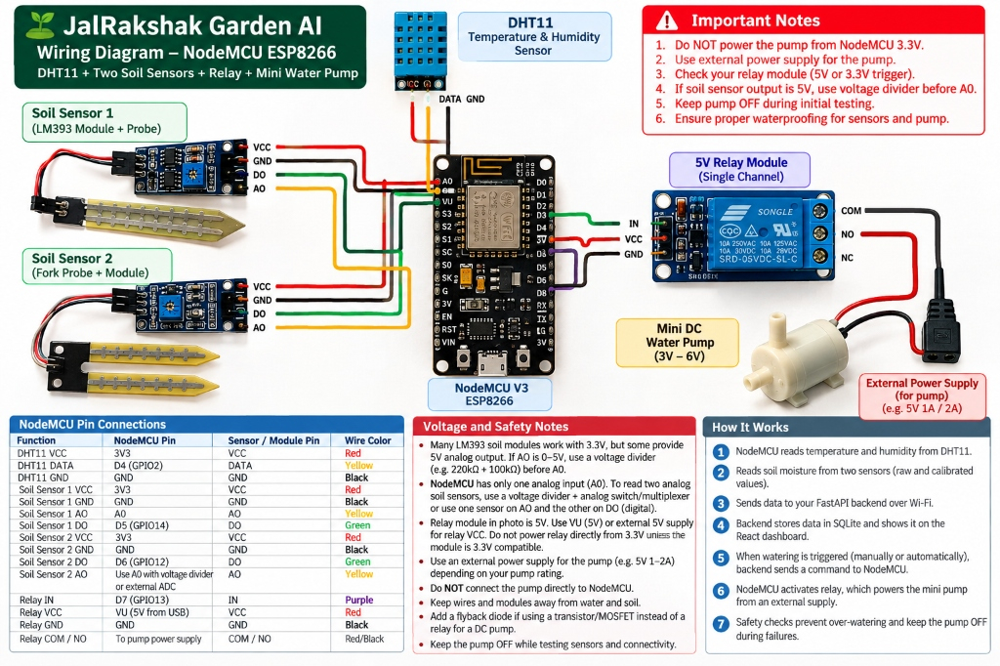
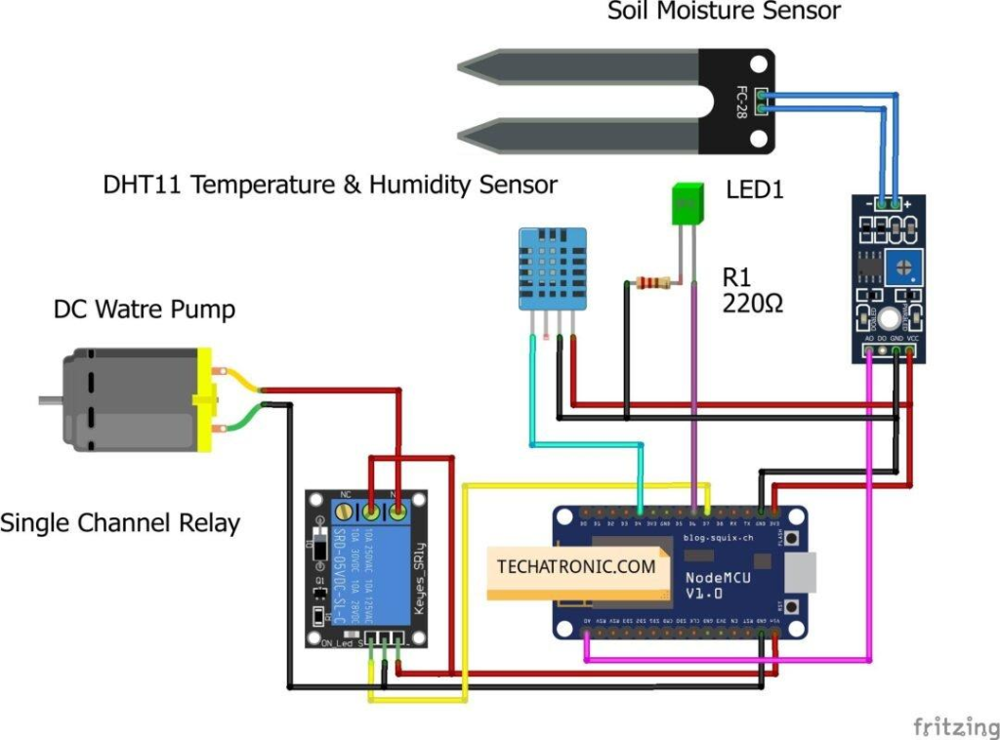

# JalRakshak Garden AI — LOLIN NodeMCU V3 ESP8266 Hardware & Wiring Guide

## 📐 Official Hardware Wiring Diagrams

### 1. Complete System Wiring Diagram


### 2. Circuit Breadboard Schematic


---

## 📌 NodeMCU V3 Pin Connections Table

| Function | NodeMCU Pin | Sensor / Module Pin | Wire Color | Electrical Notes |
| :--- | :--- | :--- | :--- | :--- |
| **DHT11 VCC** | **3V3** | VCC | Red | Regulated 3.3V power |
| **DHT11 DATA** | **D4 (GPIO2)** | DATA | Yellow | 3.3V 1-wire communication (internal/external pull-up) |
| **DHT11 GND** | **GND** | GND | Black | Common ground |
| **Soil Sensor 1 VCC** | **3V3** | VCC | Red | Regulated 3.3V rail |
| **Soil Sensor 1 GND** | **GND** | GND | Black | Common ground |
| **Soil Sensor 1 AO** | **A0** | AO | Yellow | 10-bit analog soil reading (0–1023) |
| **Soil Sensor 1 DO** | **D5 (GPIO14)** | DO | Green | Digital comparator threshold signal |
| **Soil Sensor 2 VCC** | **3V3** | VCC | Red | Regulated 3.3V rail |
| **Soil Sensor 2 GND** | **GND** | GND | Black | Common ground |
| **Soil Sensor 2 DO** | **D6 (GPIO12)** | DO | Green | Digital comparator threshold signal |
| **Soil Sensor 2 AO** | Use A0 or Ext ADC | AO | Yellow | Shared via voltage divider or external ADC |
| **Relay IN** | **D7 (GPIO13)** | IN | Purple | Optocoupler control signal (Active-LOW recommended) |
| **Relay VCC** | **VU (5V USB)** | VCC | Red | 5V relay coil supply from USB power |
| **Relay GND** | **GND** | GND | Black | Common ground |
| **Relay COM / NO** | In-series with Pump | COM / NO | Red/Black | Switches external 5V 1A/2A pump power supply |

---

## ⚠️ Voltage & Hardware Safety Rules

1. **Do NOT power the pump from NodeMCU 3.3V or VU pins:** The mini DC water pump draws 350mA–1A surge current. Always use an **independent external power supply** (e.g. 5V 1A/2A adapter or battery pack).
2. **Relay Module Voltage:** Most single-channel relay modules require 5V on VCC to reliably energize the coil. Power the relay VCC from the NodeMCU **VU** pin (5V from USB), but keep the control pin (`IN`) connected to **D7** (3.3V logic compatible).
3. **Soil Sensor Analog Voltage:** Many LM393 soil modules run at 3.3V, but if powered from 5V, the analog output will be 0–5V. Because NodeMCU's onboard divider is designed for 3.3V max into A0, always power LM393 sensors from **3V3** or use an external divider before A0.
4. **Inductive Flyback Diode:** When driving the DC pump, place a flyback diode (e.g., 1N4007) across the pump motor terminals to absorb reverse EMF voltage spikes.
5. **Fail-Safe Startup:** Initialize the relay pin (`D7`) to `HIGH` before configuring `pinMode(D7, OUTPUT)` to prevent relay click surges during boot.
6. **Waterproofing:** Keep microcontroller boards and relay modules physically separated and elevated from soil and water reservoirs.

---

## ⚡ How the Automated System Works

1. **Environmental Sensing:** NodeMCU reads temperature and humidity from the DHT11 sensor on pin **D4**.
2. **Dual-Zone Soil Sensing:** NodeMCU reads continuous analog moisture from Sensor 1 (**A0**) and digital threshold states from Sensor 1 (**D5**) and Sensor 2 (**D6**).
3. **Telemetry Streaming:** NodeMCU dispatches periodic non-blocking JSON telemetry over Wi-Fi to the FastAPI backend at `POST /api/iot/telemetry`.
4. **Persistence & Analytics:** FastAPI validates readings, updates SQLite, checks rain forecasts, and broadcasts live telemetry to the React dashboard over WebSockets.
5. **Botanical Rules & Safety Watchdog:** The rules engine evaluates soil moisture against plant thresholds, enforcing cooldowns and runtime caps.
6. **Relay Actuation:** When watering is triggered and approved, the backend issues an authorized command; NodeMCU energizes the relay on **D7**, activating the pump from its external power supply.
7. **Emergency Cutoffs:** Auto-cutoff timers, low-reservoir cutoffs ($\le 15\%$), and sticky emergency stops ensure fail-safe protection.

---

## 🚀 Flashing the Firmware

### Option 1: Arduino IDE
Open `firmware/esp8266-garden-controller/esp8266-garden-controller.ino`:
- **Board:** NodeMCU 1.0 (ESP-12E Module)
- **Upload Speed:** 115200
- **Port:** COM4

### Option 2: PlatformIO
```powershell
python -m platformio run -d firmware/esp8266-garden-controller --target upload --upload-port COM4
```
